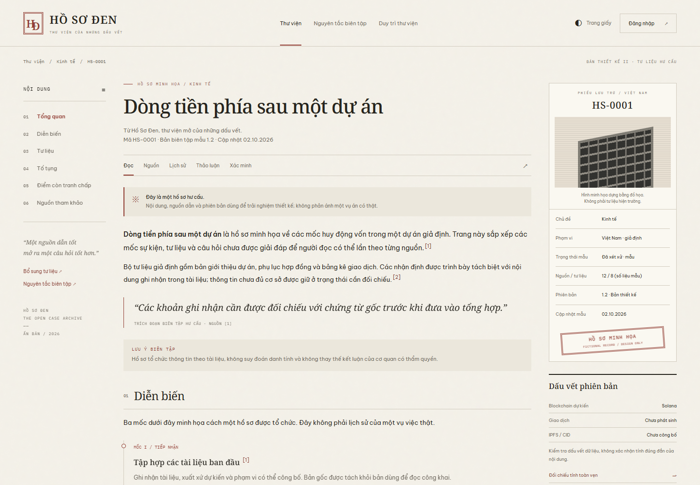

# Hồ Sơ Đen

**Thư viện của những dấu vết. Mã nguồn mở. Hướng đến local-first.**

[Xem preview](https://realitechteam.github.io/ho-so-den/) · [English](docs/README.en.md) · [Tự chạy](docs/SELF_HOSTING.md) · [Đóng góp mã nguồn](CONTRIBUTING.md) · [Lộ trình](ROADMAP.md)

> **v0.1.0-alpha.1 — design preview / pre-alpha.** Repo hiện là bản xem thử có thể tự host, không phải hệ thống quản lý hồ sơ hoàn chỉnh. Chưa có database, upload, tài khoản thật, push cộng đồng, thanh toán hoặc blockchain. Mọi hồ sơ, nguồn dẫn và số liệu đều hư cấu. Đọc [đối chiếu yêu cầu](docs/REQUIREMENTS.md) trước khi đánh giá khả năng triển khai.

## Tầm nhìn



[Xem theme Mực đêm](docs/assets/preview-ink.png)

Bạn cài Hồ Sơ Đen trên máy tính, NAS hoặc VPS; lưu và quản lý tư liệu của mình. Khi muốn đóng góp, bạn chọn một phiên bản và các tệp được phép công bố để gửi **một bản sao** lên máy chủ cộng đồng. Máy chủ tiếp nhận riêng, kiểm tra và biên tập trước khi xuất bản. Bản local không bị ghi đè bởi bản cộng đồng.

Đây là **kiến trúc mục tiêu**. Các khả năng lưu kho local và gửi đóng góp chưa có trong bản phát hành này.

## Hiện có

- Giao diện wiki ba cột, hai theme **Trang giấy / Mực đêm**.
- Sáu hồ sơ hư cấu; tìm kiếm tiếng Việt có/không dấu, lọc và sắp xếp.
- Trang đọc, chú thích nguồn, lịch sử mẫu, ghi chú trong phiên và màn hình xác minh mẫu.
- Luồng OTP email demo (`123456`) và checkout Cryptomus demo; không gửi dữ liệu.
- Server preview Node.js, Docker Compose, health check và font phục vụ tại chỗ.
- Kiểm thử HTTP, trình duyệt và workflow CI; cấu hình publish GitHub Pages.

Không có analytics, tracking pixel, font CDN hoặc kết nối cộng đồng tự động. Font và dependency cần Internet khi cài/build lần đầu; sau đó preview chạy mà không cần dịch vụ Internet ngoài. Xem [quyền riêng tư](docs/PRIVACY.md).

## Chạy nhanh bằng Docker

Yêu cầu Git, Docker Engine/Desktop đang chạy và Docker Compose v2.

```sh
git clone https://github.com/realitechteam/ho-so-den.git
cd ho-so-den
docker compose up -d --build
```

Mở **http://localhost:8080**. Cấu hình mặc định chỉ bind vào loopback, không mở dịch vụ ra mạng LAN. Dừng bằng `docker compose down`.

**Đây là tự host bản preview.** Không có volume hồ sơ hoặc chức năng lưu tài liệu riêng. Không mount dữ liệu cá nhân vào thư mục website.

## Chạy bằng Node.js

Node.js 22 trở lên; Node.js 24 LTS được khuyến nghị.

```sh
npm ci
npm run build
npm start
```

Mở **http://127.0.0.1:8080**. `npm run dev` build rồi khởi chạy server; chưa có hot reload. Sau khi sửa frontend, chạy lại `npm run build` và refresh trình duyệt.

## Kiểm thử

```sh
npm run check
npm test
npx playwright install chromium
npm run test:e2e
```

Trên Linux có thể dùng `npx playwright install --with-deps chromium`. Cấu hình test tự khởi động server trên `127.0.0.1:4173`. Xem [hướng dẫn phát triển](CONTRIBUTING.md).

## Hướng kiến trúc

- **Local instance:** Node.js, SQLite và filesystem; đăng nhập quản trị local, hoạt động độc lập.
- **Community instance:** PostgreSQL, object storage, OTP email, hàng đợi duyệt đóng góp.
- **Xuất bản:** IPFS cho tư liệu đã duyệt; Solana/Rust/Anchor cho dấu vết phiên bản.
- **Tài trợ:** chỉ Cryptomus; coin/mạng thanh toán độc lập với Solana.
- **Quyền quyết định:** người dùng chọn từng gói gửi; không tự scan hoặc đồng bộ kho local.

Chi tiết trong [kiến trúc](docs/ARCHITECTURE.md) và [giao thức đóng góp dự kiến](docs/CONTRIBUTION_PROTOCOL.md). Không có chương trình Solana hoặc endpoint đóng góp hoạt động trong release này.

## Cấu trúc repo

```text
index.html, app.js, article.js     Giao diện và dữ liệu hư cấu
styles.css, wiki.css              Hai theme đọc
scripts/                         Build, server, đóng gói release
tests/                           HTTP và browser tests
docs/                            Kiến trúc, self-host, privacy, yêu cầu
.github/                         Issue/PR templates, CI, Pages
Dockerfile, compose.yaml         Chạy preview cục bộ
LICENSE                          GNU AGPL v3 đầy đủ
```

`dist/`, `release/`, dependency và kết quả test được tạo cục bộ, không commit. Chỉ `dist/` được đưa lên hosting preview.

## Tham gia cộng đồng

- Báo lỗi và đề xuất qua [Issues](https://github.com/realitechteam/ho-so-den/issues).
- Thảo luận kiến trúc qua [Discussions](https://github.com/realitechteam/ho-so-den/discussions).
- Đọc [CONTRIBUTING](CONTRIBUTING.md), [Code of Conduct](CODE_OF_CONDUCT.md), [Governance](GOVERNANCE.md).
- Vấn đề bảo mật: [SECURITY.md](SECURITY.md); không đăng dữ liệu nhạy cảm vào issue công khai.
- GitHub Issues/PRs là nơi phát triển phần mềm, **không phải nơi gửi hồ sơ vụ việc thật**.

## Giấy phép

Copyright © 2026 Hồ Sơ Đen contributors. Mã nguồn, tài liệu do dự án viết và fixture hư cấu được phát hành theo **GNU AGPL-3.0-only**, không có bảo hành. Toàn văn: [LICENSE](LICENSE).

Bạn được phép sử dụng, sửa đổi và phân phối theo giấy phép. Khi vận hành phiên bản sửa đổi có người dùng tương tác qua mạng, thực hiện nghĩa vụ cung cấp Corresponding Source theo điều 13. Khi fork và triển khai, cập nhật liên kết **Mã nguồn** trong giao diện tới mã của đúng phiên bản bạn đang chạy.

Font có giấy phép **SIL OFL-1.1**, tách biệt với AGPL; xem [THIRD_PARTY_NOTICES](THIRD_PARTY_NOTICES.md). Giấy phép phần mềm không tự áp dụng cho ảnh/video/hồ sơ của người dùng và không cấp quyền ngụ ý được dự án bảo trợ; xem [NOTICE](NOTICE) và [chính sách tên gọi](docs/TRADEMARKS.md).
